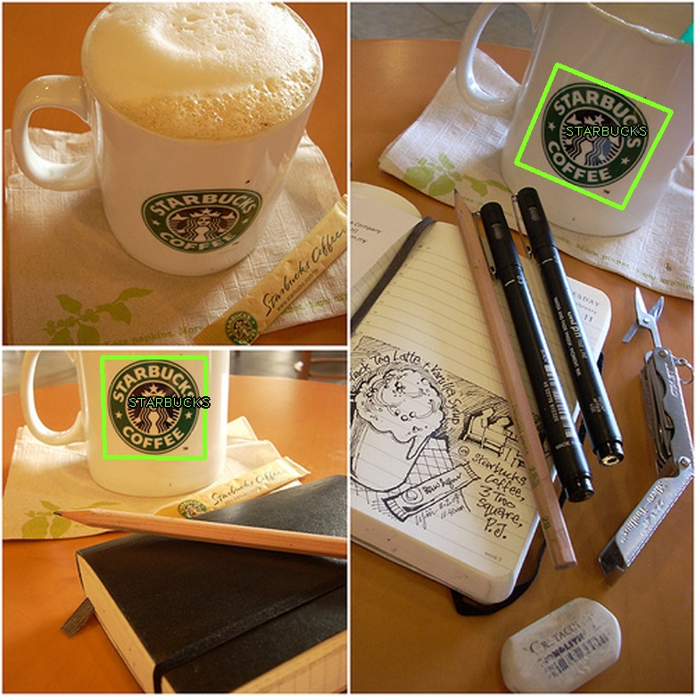
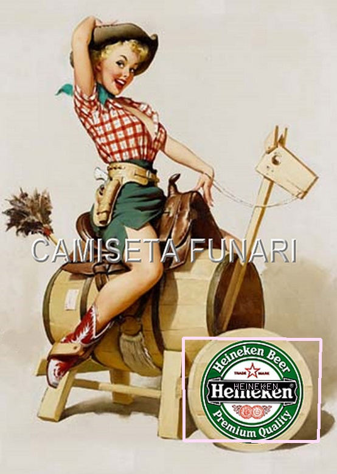

# Logo Recognition Test Assignment

 

## About

This is a solution to a test assignment that landed my first coding job. The task went like this:
given reference images of logotypes, design and implement the algorithm to locate them on 
given scene images. Considering there were no ground truth, I went with keypoint-based detection. 

Recently I decided to update the code, without changing core algorithm, 
to showcase at least some of my progress. 

Original dataset was lost, but I've found a similar one [here](http://image.ntua.gr/iva/datasets/flickr_logos/).

Moving to CCNs would be a fun task for another time. 

## Dependecies

```
opencv-4 build with nonfree module
boost
gflags
```

Target platform is Linux, but with some tweaks it should be possible to build on others. 

`src/install-opencv-4.sh` script should be of help in building required opencv configuration.

## Usage

Example usage:

```
$ ./label-detection -objects data/reference -scenes data -jobs 8
```

Supported command line options:
 
 ```$xslt
$ label-detection --help

 Usage:
     -jobs (number of concurrent matching jobs) type: int32 default: 8
 
     -obj_min_hess (Threshold for hessian keypoint detector used in SURF for
       extracting features from the reference image) type: int32 default: 400
 
     -obj_size (each reference image will be resized down, so that itsmax
       dimension was not exceeding this value) type: int32 default: 256
 
     -objects (path to directory with reference images) type: string default: ""
 
     -scenes (path to directory with scene images) type: string default: ""
 
     -scn_min_hess (Threshold for hessian keypoint detector used in SURF for
       extracting features from the scene image) type: int32 default: 750
 
     -scn_size (each scene image will be resized so that its max dimension was
       equal to this value) type: int32 default: 780
```
